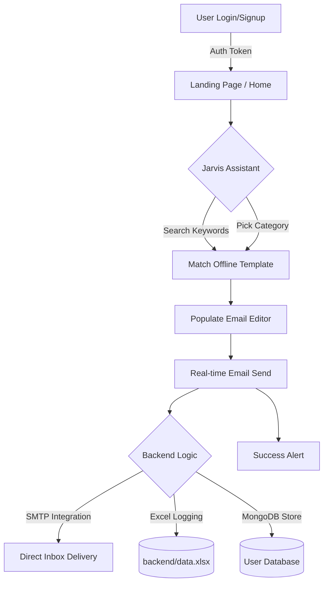
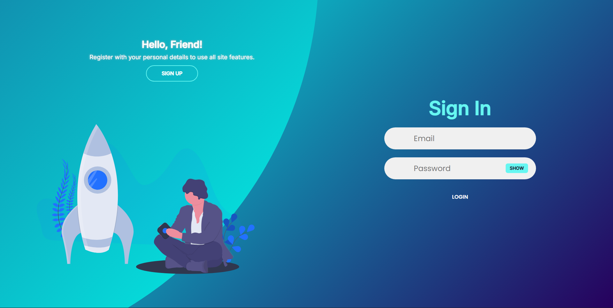
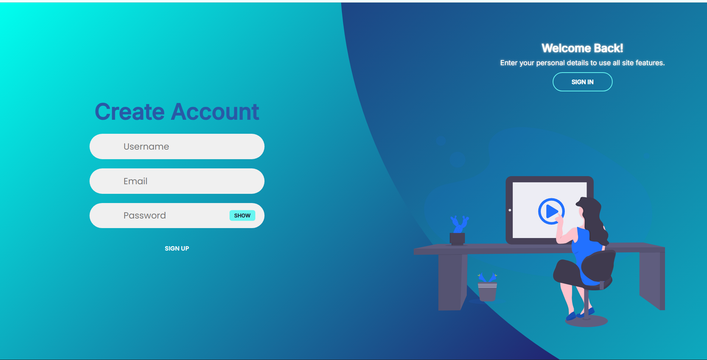

# 🚀 Mail.Me - Smart Email Automation Platform

Mail.Me is a high-performance, full-stack email automation tool designed to help professionals craft, manage, and send high-quality emails instantly. Featuring **Jarvis**, an offline intelligent assistant with 20+ premium templates, real-time SMTP integration, and automated Excel data logging.

---

## 🏗️ System Architecture & Workflow

Below is the workflow showing how a user interacts with the system, from template generation via Jarvis to real-time email delivery and automated data logging.



---

## ✨ Features

### 🤖 Jarvis: Smart Offline Assistant
*   **Zero-API Dependency**: Works instantly without external AI costs (like Gemini/OpenAI).
*   **20+ Premium Templates**: Spread across 10+ sections including:
    *   Job Applications & Internship Requests
    *   Business Outreach & Sales Pitches
    *   Leave Applications (Sick, Vacation)
    *   Promotional Offers & Newsletters
    *   Events & Meeting Requests

### 📧 Real-time Email Activities
*   **SMTP Integration**: Successfully activated with Gmail for real-time delivery.
*   **Advanced Editor**: Custom headers, footers, and placeholder support.
*   **Dual Tracking**: Every email sent is saved to both MongoDB and `data.xlsx`.

### 📊 Automated Excel Data Logging
*   **Sheet 1 (Signups)**: Logs newly registered users.
*   **Sheet 2 (Logins)**: Tracks user session events.
*   **Sheet 3 (Sent Emails)**: Logs recipient, subject, and delivery status.
*   **Sheet 4 (Saved Emails)**: Logs drafts and saved templates.

### 🛡️ Secure & Modern UI
*   **Show/Hide Password**: Improved user experience in login/signup forms.
*   **JWT Authentication**: Ensures secure data handling and protected routes.
*   **AOS Animations**: Professional scroll animations on the landing page.

---

## 🛠️ Setup Instructions

Follow these steps to get the project running on your local machine.

### 1. Prerequisites
*   [Node.js](https://nodejs.org/) (Latest LTS version recommended)
*   [MongoDB](https://www.mongodb.com/try/download/community) (Running on your local machine)

### 2. Installation
Clone the repository and install dependencies for both frontend and backend:
```bash
# Install core dependencies
npm install

# Install-all script (if available)
npm run install-all
```

### 3. Environment Configuration
Create a `.env` file in the `backend/` directory and add the following:
```env
PORT=5001
CONNECTION_STRING=mongodb://127.0.0.1:27017/mail_me
ACCESS_TOKEN=your_super_secret_token
EMAIL_USER=your-email@gmail.com
EMAIL_PASS=your-16-digit-app-password
```
> [!IMPORTANT]
> For `EMAIL_PASS`, you must generate an **App Password** from your Google Account settings. Regular passwords will not work.

### 4. Running the Application
Run both the frontend and backend concurrently with a single command:
```bash
npm run dev
```
*   **Frontend**: `http://localhost:5173`
*   **Backend**: `http://localhost:5001`

---

## 📁 Project Structure

```text
mail.me-project-main/
├── backend/
│   ├── config/          # DB Connection setup
│   ├── controllers/     # Business logic (Jarvis, Email, Users)
│   ├── middleware/      # Auth & Token validation
│   ├── models/          # MongoDB Schemas
│   ├── routes/          # API Endpoint definitions
│   ├── utils/           # ExcelHelper logging
│   ├── data.xlsx        # AUTOMATED DATA LOG
│   └── .env             # SMTP & DB configuration
├── frontend/
│   ├── src/
│   │   ├── css/         # Modular Styling
│   │   └── pages/       # Home, Auth, Landing UI
│   └── package.json
└── package.json         # Unified task runner
```
---

## 🖼️ User Interface Gallery

### 1. Authentication Flow
Secure access with modern, responsive Login and Signup interfaces featuring JWT-based protection.

| Login Page | Signup Page |
| :---: | :---: |
|  |  |

---

### 2. Dashboard & Navigation
Professional landing and services overview showcasing the platform's core capabilities.

| Landing Page | Services Overview |
| :---: | :---: |
|  |  |

---

### 3. Core Features in Action
The heart of Mail.Me: Jarvis AI for template generation and the advanced real-time email editor.

#### **Jarvis AI Assistant**
*Instantly generate templates from over 20+ offline categories.*


#### **Email Editor & Preview**
*Real-time preview and custom placeholder integration for personalized outreach.*


---
---

## 🤝 Contributing
Feel free to fork this project and submit a Pull Request for any new features or improvements.

**Developed by: Ayusman 🚀**
